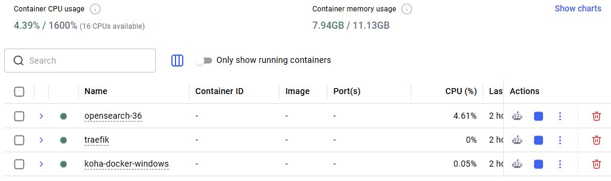

# koha-docker-windows

This project is a derivation of the `https://github.com/kosson/koha-docker` repo. It's for those who use Windows as main development platform. In the aforementioned repo some very sound patterns and ideas were taken from the work done for the project at [koha-testing-docker (a.k.a. KTD)](https://gitlab.com/koha-community/koha-testing-docker).
All the heavy lifting was done using AI agents via a Github subscription. Most of the avatars during development can be tracked if you look into the TRACKER.md file.

Use the source code as is. Remember this is a development project to experiment with Koha, to migrate data, etc. This is not a production suite.

## Scope

Building a cluster of Docker containers that gives the possibility to work with Koha latest version. At the time of this repo initialization the verion is Koha 25.12.00. Koha needs a database (MariaDB), a caching mecanism (Memcache), an indexing engine (OpenSearch), and a proxy for accesing the instalation in the browser (Traefik).

## Prerequisites

You need to have a fairly well endowed computer to run these services. All the final product will need around 12Gb of RAM to run comfortable. The RAM of your computer needs to be at least 16Gb, which is not that rare these days. You need to activate virtualization in BIOS so that some cores of your processors may be "borrowed" for the containers we raise for each of the components. Also, you need to have a good Internet connection. First thing on the list is installing Docker Desktop. This is the main ingredient. Follow, the list:

- Docker Desktop (Linux containers mode)
- PowerShell 5.1+
- Git for Windows
- WSL installed (see: https://docs.docker.com/desktop/features/wsl/) needed by Docker Desktop.

Notes:

- The OpenSearch certificate generator auto-detects `openssl.exe` from common Git for Windows (https://git-scm.com/install/windows) locations.
- OpenSSL in PATH is optional. The script will try and solve this automaticaly. Further down there a instructions on how you could install it by yourself if you want to.
- For Docker you need at least 8Gb of RAM, a 64bit processor with at least four cores (8 threads), at least 20Gb of HDD/SSD, and virtualization activated in BIOS/EFI to avoid errors described in the following online document: https://docs.docker.com/desktop/troubleshoot-and-support/troubleshoot/topics/#docker-desktop-fails-due-to-virtualization-not-working.

Check the needed tools if they are installed:

```powershell
git --version
docker --version
docker compose version
wsl --version
```

Every command from the listed above run in the PowerShell should yield the version of the installed package. Solve these requirements first. Copy every command on each line separately.
If you do not have WSL install it with `wsl --install`. If you have it, update it: `wsl --update`.

Optional check for OpenSSL. OpenSSL is very important being used in cryptographic keys generation (see OpenSearch):

```powershell
openssl version
```

If you don't have OpenSSL installed run in PowerShell (as Administrator) the following: `winget install --id=FireDaemon.OpenSSL -e`. Close PowerShell and open it again. Check for version. If no answer is given in the shell, then it needs to be added to the PATH. Run in the shell the following: `$Env:PATH += ";C:\Program Files\FireDaemon OpenSSL 3\bin"`.
OpenSSL is also part of the Git for Windows as mentioned prior.

Now, it is the time to install Docker Desktop if you haven't done that already - https://docs.docker.com/get-started/get-docker/.

Download the code for the project from this repo. Look at the green buton `Code`, and choose to download the zip version. If you have an account at Github use it to download the resources. After you have downloaded the code, unarchive it to a folder of your own choosing. A good idea is to put it in a `DEVELOPMENT` subfolder in `Documents`. This is just a sugestion. Now, after you have unzipped the filed, unfortunately, the source code is put in another subfolder called `koha-docker-windows-main`. Enter it, cut all the content, and paste it above so everything is in the correct subfolder named `koha-docker-windows`. This is a Github zipping process quirk. After you move the content, the `koha-docker-windows-main` is empty, so delete it, so it stops being a useless cruft.

Now, the `koha-docker-windows` sobfolder will be named _root folder_ from now on.

## Quick start

1. We need all the source code of Koha ILS, so, being in the root folder of your project, run in the PowerShell in the root of the project:

```powershell
git clone --depth=1 https://git.koha-community.org/Koha-community/Koha.git koha
```

2. Configure Windows host paths in env/.env. These settings are crucial, so track them in the `.env` file in the `env` subfolder, and put your own paths reflecting your location of choice:

```env
DOCKER_BINARY=docker
SYNC_REPO=C:/Users/nicolaie/Documents/DEVELOPMENT/koha-docker-windows/koha
OPENSEARCH_CA_CERT=C:/Users/nicolaie/Documents/DEVELOPMENT/koha-docker-windows/OpenSearch-3.6/assets/ssl/root-ca.pem
```

For `SYNC_REPO`, the path should be the `koha` subfolder that was created at in the previous step.
For the `OPENSEARCH_CA_CERT` put the same path just in front of the ending sequence `/OpenSearch-3.6/assets/ssl/root-ca.pem`. Observe that the file `root-ca.pem` referenced in the path might not exist at this stage. This is ok. It will be created in the following step.

Be very thorough with these paths. Double check everything. Notice the fact that if you copy the path from the exploring window, the systems uses backslashes, a characteristic of Windows OS. When you paste in the `.env` file correct those to slashes. For example, `C:\Users\kosson\Documents\DEVELOPMENT\koha-docker-windows`, needs to be `C:/Users/kosson/Documents/DEVELOPMENT/koha-docker-windows`. Again, be mindful of your own paths, do not copy these examples.

3. Generate OpenSearch certificates:

Now, because OpenSearch needs a secure communication between its nodes, we need to create the cryptographic keys it uses. Set execution policy for the current user. 

But first, we need to allow Windows security policies to run our PowerShell scripts. First, go to System -> Advanced and activate `Developer Mode` (On). Then PowerShell -> Change execution policy to allow local PowerShell scripts to run without signing (On). In the opened PowerShell, paste the following command and enter it:

```powershell
Set-ExecutionPolicy -ExecutionPolicy RemoteSigned -Scope CurrentUser
```

Confirm it with `A` meaning All. It should be like below:

```powershell
PS C:\Users\kosson> Get-ExecutionPolicy -List

        Scope ExecutionPolicy
        ----- ---------------
MachinePolicy       Undefined
   UserPolicy       Undefined
      Process       Undefined
  CurrentUser    RemoteSigned
 LocalMachine    RemoteSigned
```

Restart because Windows.

Now, for every subfolder `OpenSearch-3.6./assets/opensearch/config/os01` ... to `os05` you have a configuration file named `opensearch.yml`. All of them have the exact same hard coded settings for the `plugins.security.nodes_dn option` as value. Modify them for to match your institutional environment. These are only for test and development builds localized to the creator of this project. You should use it as is only to test. Modify it to adapt it to your institution. Also, the `plugins.security.compliance.salt` and `plugins.query.datasources.encryption.masterkey` values will be re-generated every time you run bash `.\opensearch_local_certificates_creator.ps1`, which you should run before starting the rest of the containers using `stack-windows.ps1` script. Down there are the settings you should make your own, Do not touch the value for `CN`. The other values for `OU`, `O`, `L`, `ST`, and `C` should be the ones you seek to modify:

```yaml
plugins.security.nodes_dn:
  - 'CN=os01,OU=DFCTI,O=NIPNE,L=Magurele,ST=ILFOV,C=RO'
  - 'CN=os02,OU=DFCTI,O=NIPNE,L=Magurele,ST=ILFOV,C=RO'
  - 'CN=os03,OU=DFCTI,O=NIPNE,L=Magurele,ST=ILFOV,C=RO'
  - 'CN=os04,OU=DFCTI,O=NIPNE,L=Magurele,ST=ILFOV,C=RO'
  - 'CN=os05,OU=DFCTI,O=NIPNE,L=Magurele,ST=ILFOV,C=RO'
  - 'CN=dashboards,OU=DFCTI,O=NIPNE,L=Magurele,ST=ILFOV,C=RO'
```

Yoy may leave it like this to work without this headache. There is not a problem because the cryptographic keys generated are local to your project. Remember to modify all the `opensearch.yml` for all the nodes.

Then run the following commands separately (every command on each line in order):

```powershell
cd .\OpenSearch-3.6
.\opensearch_local_certificates_creator.ps1
cd ..
```

If you have issues concerning security imposed on running the scripts, run the script with the following:

```powershell
powershell.exe -ExecutionPolicy Bypass -File .\opensearch_local_certificates_creator.ps1
```

It is Windows way. Another way is to right click on the script file and tick the `Unblock` in the `Security` section, or in PowerShell: `Unblock-File -Path .\opensearch_local_certificates_creator.ps1`.

You should obtain in the PowerShell an output similar to the following:

```txt
[INFO ] Loading config: C:\Users\kosson\Documents\DEVELOPMENT\koha-docker-windows\OpenSearch-3.6\opensearch_installer_vars.cfg
[INFO ] Using OpenSSL: C:\Program Files\FireDaemon OpenSSL 4\bin\openssl.exe
[INFO ] Creating root CA key and certificate...
[INFO ] Creating admin TLS certificate...
Certificate request self-signature ok
subject=C=RO, ST=ILFOV, L=MAGURELE, O=NIPNE, OU=DFCTI, CN=admin
[INFO ] Creating TLS certificate for os01...
Certificate request self-signature ok
subject=C=RO, ST=ILFOV, L=MAGURELE, O=NIPNE, OU=DFCTI, CN=os01
[INFO ] Creating TLS certificate for os02...
Certificate request self-signature ok
subject=C=RO, ST=ILFOV, L=MAGURELE, O=NIPNE, OU=DFCTI, CN=os02
[INFO ] Creating TLS certificate for os03...
Certificate request self-signature ok
subject=C=RO, ST=ILFOV, L=MAGURELE, O=NIPNE, OU=DFCTI, CN=os03
[INFO ] Creating TLS certificate for os04...
Certificate request self-signature ok
subject=C=RO, ST=ILFOV, L=MAGURELE, O=NIPNE, OU=DFCTI, CN=os04
[INFO ] Creating TLS certificate for os05...
Certificate request self-signature ok
subject=C=RO, ST=ILFOV, L=MAGURELE, O=NIPNE, OU=DFCTI, CN=os05
[INFO ] Creating TLS certificate for client...
Certificate request self-signature ok
subject=C=RO, ST=ILFOV, L=MAGURELE, O=NIPNE, OU=DFCTI, CN=client
[INFO ] Creating TLS certificate for dashboards...
Certificate request self-signature ok
subject=C=RO, ST=ILFOV, L=MAGURELE, O=NIPNE, OU=DFCTI, CN=dashboards
[ OK  ] Compliance salt and SQL master key written to all node configs.
  compliance salt : xXwreFzh5RBczEIg
  SQL master key  : f329059be0f53cebbf51216af131561c
Store these values securely; they are required to restore the cluster.
[ OK  ] Best-effort ACL update applied for PEM files on Windows.
[ OK  ] Certificate generation completed.
```

The script also updates the compliance salt and SQL master key in all `opensearch.yml` files so those settings stay in sync with the newly generated certs.

4. Start the full stack

First, start Docker Desktop application. This will run the `docker` application in background. This is mandatory.

Now, run the command in the PowerShell in the root of your project:

```powershell
.\stack-windows.ps1 start
```

or for the melodramatic Windows, as above:

```powershell
powershell.exe -ExecutionPolicy Bypass -File .\stack-windows.ps1 start
```

If an error like the following stops the setup process, just run the script again. The possible error:

```powershell
[INFO ] Resetting database 'koha_kohadev'...
--------------
GRANT ALL PRIVILEGES ON koha_kohadev.* TO 'koha_kohadev'@'%'
--------------

ERROR 1133 (28000) at line 3: Can't find any matching row in the user table
Failed to reset database 'koha_kohadev'.
At C:\Users\Alina\Documents\koha-docker-windows\stack-windows.ps1:19 char:35
+ function Fail([string]$Message) { throw $Message }
+                                   ~~~~~~~~~~~~~~
    + CategoryInfo          : OperationStopped: (Failed to reset database 'koha_kohadev'.:String) [], RuntimeException
    + FullyQualifiedErrorId : Failed to reset database 'koha_kohadev'.
```

Tip: use `-NoLogs` if you do not want log tailing after startup.

Confirm any messages from Docker Desktop concerning acces to networks.

First, the OpenSearch cluster is formed, then the Traefik container, MariaDB and Memcached, and finaly the Koha container. Following is a succession of mesages you should see:

```powershell
=============================================
  Koha + OpenSearch Windows Stack Manager
=============================================

[ OK  ] Network 'frontend' already exists.
[INFO ] Starting OpenSearch cluster (first)...
 ✔ Image opensearch-36-os05      Built     5.6s
 ✔ Image opensearch-36-os01      Built     5.6s
 ✔ Image opensearch-36-os02      Built     5.6s
 ✔ Image opensearch-36-os03      Built     5.6s
 ✔ Image opensearch-36-os04      Built     5.6s
 ✔ Network opensearch-36_osearch Created   0.1s
 ✔ Network knonikl               Created   0.1s
 ✔ Volume opensearch-36_os03data Created   0.0s
 ✔ Volume opensearch-36_os04data Created   0.0s
 ✔ Volume opensearch-36_os05data Created   0.0s
 ✔ Volume opensearch-36_os01data Created   0.0s
 ✔ Volume opensearch-36_os02data Created   0.0s
 ✔ Container os01                Healthy   7.1s
 ✔ Container os03                Started   1.4s
 ✔ Container os04                Started   1.4s
 ✔ Container os02                Started   1.4s
 ✔ Container os05                Started   1.3s
 ✔ Container dashboards          Started   7.6s
[ OK  ] OpenSearch containers started.
[INFO ] Waiting for OpenSearch cluster status to become green...
[ OK  ] OpenSearch cluster is green.
[INFO ] Starting Traefik...
[+] up 8/8
 ✔ Image traefik:latest Pulled   9.1s
 ✔ Container traefik    Started  0.6s
[ OK  ] Traefik started.
[INFO ] Starting MariaDB and Memcached...
[+] up 2/2
 ✔ Container koha-docker-windows-memcached-1 Started    0.3s
 ✔ Container koha-docker-windows-db-1        Started    0.3s
[ OK  ] Support services started.
[INFO ] Waiting for MariaDB in 'koha-docker-windows-db-1'...
  attempt 1/30...
[ OK  ] MariaDB is ready.
[INFO ] Resetting database 'koha_kohadev'...
[ OK  ] Database 'koha_kohadev' is ready.
[INFO ] Starting Koha container...
 ✔ Image koha-docker-windows-koha            Built       160.2s
 ✔ Container koha-docker-windows-db-1        Running     0.0s
 ✔ Container koha-docker-windows-memcached-1 Running     0.0s
 ✔ Container koha-docker-windows-koha-1      Started     1.7s
[ OK  ] Koha container started.

URLs:
  OPAC:      http://kohadev.127.0.0.1.nip.io
  Staff:     http://kohadev-intra.127.0.0.1.nip.io
  Dashboards:http://dashboards.localhost
  Traefik:   http://localhost:8083

Demo data mode: yes

[INFO ] Tailing Koha logs (Ctrl+C to stop following logs)...
koha-1  |  [ - ]  apache-htcacheclean
koha-1  |  [ - ]  apache2
koha-1  |  [ - ]  atd
koha-1  |  [ - ]  cron
koha-1  |  [ - ]  dbus
koha-1  |  [ - ]  koha-common
koha-1  |  [ - ]  memcached
koha-1  |  [ - ]  procps
koha-1  |  [ - ]  rabbitmq-server
koha-1  |  [ - ]  x11-common
koha-1  | Running [sudo cp /kohadevbox/koha/debian/templates/* /etc/koha]...
koha-1  | Running [sudo cp /kohadevbox/koha/debian/koha-post-install-setup /usr/sbin]...
koha-1  | Running [sudo cp /kohadevbox/koha/debian/unavailable.html /usr/share/koha/intranet/htdocs]...
koha-1  | Running [sudo cp /kohadevbox/koha/debian/unavailable.html /usr/share/koha/opac/htdocs]...
koha-1  | Running [sudo cp /kohadevbox/koha/debian/templates/* /etc/koha]...
koha-1  | Running [sudo cp /kohadevbox/koha/debian/scripts/koha-functions.sh /usr/share/koha/bin]...
koha-1  | Running [sudo cp /kohadevbox/koha/debian/scripts/koha-create /usr/sbin]...
koha-1  | Running [sudo cp /kohadevbox/koha/debian/scripts/koha-create-dirs /usr/sbin]...
koha-1  | Running [sudo cp /kohadevbox/koha/debian/scripts/koha-disable /usr/sbin]...
koha-1  | Running [sudo cp /kohadevbox/koha/debian/scripts/koha-dump /usr/sbin]...
koha-1  | Running [sudo cp /kohadevbox/koha/debian/scripts/koha-dump-defaults /usr/sbin]...
koha-1  | Running [sudo cp /kohadevbox/koha/debian/scripts/koha-elasticsearch /usr/sbin]...
koha-1  | Running [sudo cp /kohadevbox/koha/debian/scripts/koha-email-disable /usr/sbin]...
koha-1  | Running [sudo cp /kohadevbox/koha/debian/scripts/koha-email-enable /usr/sbin]...
koha-1  | Running [sudo cp /kohadevbox/koha/debian/scripts/koha-enable /usr/sbin]...
koha-1  | Running [sudo cp /kohadevbox/koha/debian/scripts/koha-es-indexer /usr/sbin]...
koha-1  | Running [sudo cp /kohadevbox/koha/debian/scripts/koha-foreach /usr/sbin]...
koha-1  | Running [sudo cp /kohadevbox/koha/debian/scripts/koha-indexer /usr/sbin]...
koha-1  | Running [sudo cp /kohadevbox/koha/debian/scripts/koha-list /usr/sbin]...
koha-1  | Running [sudo cp /kohadevbox/koha/debian/scripts/koha-mysql /usr/sbin]...
koha-1  | Running [sudo cp /kohadevbox/koha/debian/scripts/koha-passwd /usr/sbin]...
koha-1  | Running [sudo cp /kohadevbox/koha/debian/scripts/koha-plack /usr/sbin]...
koha-1  | Running [sudo cp /kohadevbox/koha/debian/scripts/koha-rebuild-zebra /usr/sbin]...
koha-1  | Running [sudo cp /kohadevbox/koha/debian/scripts/koha-remove /usr/sbin]...
koha-1  | Running [sudo cp /kohadevbox/koha/debian/scripts/koha-reset-passwd /usr/sbin]...
koha-1  | Running [sudo cp /kohadevbox/koha/debian/scripts/koha-restore /usr/sbin]...
koha-1  | Running [sudo cp /kohadevbox/koha/debian/scripts/koha-run-backups /usr/sbin]...
koha-1  | Running [sudo cp /kohadevbox/koha/debian/scripts/koha-shell /usr/sbin]...
koha-1  | Running [sudo cp /kohadevbox/koha/debian/scripts/koha-sip /usr/sbin]...
koha-1  | Running [sudo cp /kohadevbox/koha/debian/scripts/koha-sitemap /usr/sbin]...
koha-1  | Running [sudo cp /kohadevbox/koha/debian/scripts/koha-translate /usr/sbin]...
koha-1  | Running [sudo cp /kohadevbox/koha/debian/scripts/koha-upgrade-schema /usr/sbin]...
koha-1  | Running [sudo cp /kohadevbox/koha/debian/scripts/koha-upgrade-to-3.4 /usr/sbin]...
koha-1  | Running [sudo cp /kohadevbox/koha/debian/scripts/koha-worker /usr/sbin]...
koha-1  | Running [sudo cp /kohadevbox/koha/debian/scripts/koha-z3950-responder /usr/sbin]...
koha-1  | Running [sudo cp /kohadevbox/koha/debian/scripts/koha-zebra /usr/sbin]...
koha-1  | Running [sudo cp /kohadevbox/koha/debian/koha-common.cron.monthly /etc/cron.monthly/koha-common]...
koha-1  | Running [sudo cp /kohadevbox/koha/debian/koha-common.cron.d /etc/cron.d/koha-common]...
koha-1  | Running [sudo cp /kohadevbox/koha/debian/koha-common.cron.hourly /etc/cron.hourly/koha-common]...
koha-1  | Running [sudo cp /kohadevbox/koha/debian/koha-common.logrotate /etc/logrotate.d/koha-common]...
koha-1  | Running [sudo cp /kohadevbox/koha/debian/koha-common.default /etc/default/koha-common]...
koha-1  | Running [sudo cp /kohadevbox/koha/debian/koha-common.init /etc/init.d/koha-common]...
koha-1  | Running [sudo cp /kohadevbox/koha/debian/koha-common.cron.daily /etc/cron.daily/koha-common]...
koha-1  | Running [sudo cp /kohadevbox/koha/debian/koha-common.bash-completion /etc/bash_completion.d/koha-common]...
koha-1  | Running [sudo xsltproc --output /usr/share/man/man8/ /usr/share/xml/docbook/stylesheet/docbook-xsl-ns/manpages/docbook.xsl /kohadevbox/koha/debian/docs/*.xml]...
koha-1  | Note: Writing koha-common.8
koha-1  | Note: Writing koha-create-dirs.8
koha-1  | Note: Writing koha-create.8
koha-1  | Note: Writing koha-disable.8
koha-1  | Note: Writing koha-dump-defaults.8
koha-1  | Note: Writing koha-dump.8
koha-1  | Note: Writing koha-elasticsearch.8
koha-1  | Note: Writing koha-email-disable.8
koha-1  | Note: Writing koha-email-enable.8
koha-1  | Note: Writing koha-enable.8
koha-1  | Note: Writing koha-es-indexer.8
koha-1  | Note: Writing koha-foreach.8
koha-1  | Note: Writing koha-indexer.8
koha-1  | Note: Writing koha-list.8
koha-1  | Note: Writing koha-mysql.8
koha-1  | Note: Writing koha-mysqlcheck.8
koha-1  | Warn: AUTHOR sect.: no personblurb|contrib for Mason James
koha-1  | Note: AUTHOR sect.: see http://www.docbook.org/tdg5/en/html/contr
koha-1  | Note: AUTHOR sect.: see http://www.docbook.org/tdg5/en/html/perso
koha-1  | Note: Writing koha-passwd.8
koha-1  | Note: Writing koha-plack.8
koha-1  | Note: Writing koha-rebuild-zebra.8
koha-1  | Note: Writing koha-remove.8
koha-1  | Note: Writing koha-reset-passwd.8
koha-1  | Note: Writing koha-restore.8
koha-1  | Note: Writing koha-run-backups.8
koha-1  | Note: Writing koha-shell.8
koha-1  | Note: Writing koha-sip.8
koha-1  | Note: Writing koha-sitemap.8
koha-1  | Note: Writing koha-translate.8
koha-1  | Note: Writing koha-upgrade-schema.8
koha-1  | Note: Writing koha-upgrade-to-3.4.8
koha-1  | Note: Writing koha-worker.8
koha-1  | Note: Writing koha-z3950-responder.8
koha-1  | Note: Writing koha-zebra.8
koha-1  | Running [sudo rm /usr/share/man/man8/koha-*.8.gz]...
koha-1  | rm: cannot remove '/usr/share/man/man8/koha-*.8.gz': No such file or directory
koha-1  | Running [sudo gzip /usr/share/man/man8/koha-*.8]...
koha-1  | Connection to db (172.21.0.3) 3306 port [tcp/mysql] succeeded!
koha-1  | See kohadev-db-request.txt for database creation request.
koha-1  | Please forward it to the right person, and then run
koha-1  | /usr/sbin/koha-create --populate-db kohadev
koha-1  | Thanks.
koha-1  | Error: worker not running for kohadev (default)
koha-1  | Error: worker not running for kohadev (long_tasks)
koha-1  |    ...fail!
koha-1  |  * Restarting Apache httpd web server apache2
koha-1  |    ...done.
koha-1  |
koha-1  | Install Koha-how-to
koha-1  | [cypress] Make the pre-built cypress available to the instance user [HACK]
koha-1  |     [*] Created cache dir /var/lib/koha/kohadev/.cache/
koha-1  |     [*] Chowning /var/lib/koha/kohadev/.cache/
koha-1  |     [*] Cypress dir linked to /var/lib/koha/kohadev/.cache/
koha-1  | [koha-l10n] Handling koha-l10n as requested
koha-1  |     [*] Cloning koha-l10n into misc/translator/po
koha-1  | Cloning into '/kohadevbox/koha/misc/translator/po'...
Updating files: 100% (956/956), done.6)
koha-1  | [API logging] Set TRACE to API log4perl config
koha-1  |     [*] TRACE set for the API log4perl configuration
koha-1  | [git] Setting up Git on the instance user
koha-1  |     [*] Generating /var/lib/koha/kohadev/.gitconfig
koha-1  |     [*] General setup
koha-1  |     [*] Installing and setting hooks (/kohadevbox/koha)
koha-1  | gitifying kohadev (/etc/koha/sites/kohadev) to point at '/kohadevbox/koha'
koha-1  |
koha-1  | I appear to be done...
koha-1  | Please remember to restart apache before trying to use 'kohadev' ;)
koha-1  | Instance kohadev already enabled.
koha-1  | Enabling site kohadev.
koha-1  | To activate the new configuration, you need to run:
koha-1  |   service apache2 reload
koha-1  | yarn install v1.22.22
koha-1  | [1/4] Resolving packages...
koha-1  | success Already up-to-date.
koha-1  | Done in 0.52s.
koha-1  | [elasticsearch] Waiting for OpenSearch endpoint from Koha container...
koha-1  | [elasticsearch] OpenSearch is green.
koha-1  | Running [sudo koha-shell kohadev -p -c 'PERL5LIB=/kohadevbox/koha:/kohadevbox/koha/lib:/kohadevbox/qa-test-tools perl /kohadevbox/misc4dev/populate_db.pl -v --opac-base-url http://kohadev.127.0.0.1.nip.io --intranet-base-url http://kohadev-intra.127.0.0.1.nip.io --marcflavour MARC21']...
koha-1  | Inserting koha db structure...
koha-1  | Inserting /kohadevbox/koha/installer/data/mysql/mandatory/sysprefs.sql...
koha-1  | Inserting /kohadevbox/koha/installer/data/mysql/mandatory/subtag_registry.sql...
koha-1  | Inserting /kohadevbox/koha/installer/data/mysql/mandatory/auth_val_cat.sql...
koha-1  | Inserting /kohadevbox/koha/installer/data/mysql/mandatory/message_transport_types.sql...
koha-1  | Inserting /kohadevbox/koha/installer/data/mysql/mandatory/sample_notices_message_attributes.sql...
koha-1  | Inserting /kohadevbox/koha/installer/data/mysql/mandatory/sample_notices_message_transports.sql...
koha-1  | Inserting /kohadevbox/koha/installer/data/mysql/mandatory/keyboard_shortcuts.sql...
koha-1  | Inserting /kohadevbox/koha/installer/data/mysql/mandatory/userflags.sql...
koha-1  | Inserting /kohadevbox/koha/installer/data/mysql/mandatory/userpermissions.sql...
koha-1  | Inserting /kohadevbox/koha/installer/data/mysql/mandatory/audio_alerts.sql...
koha-1  | Skipping /kohadevbox/koha/installer/data/mysql/mandatory/account_offset_types.sql
koha-1  | Skipping /kohadevbox/koha/installer/data/mysql/mandatory/account_credit_types.sql
koha-1  | Skipping /kohadevbox/koha/installer/data/mysql/mandatory/account_debit_types.sql
koha-1  | Inserting /kohadevbox/koha/installer/data/mysql/en/mandatory/account_credit_types.yml...
koha-1  | Inserting /kohadevbox/koha/installer/data/mysql/en/mandatory/account_debit_types.yml...
koha-1  | Inserting /kohadevbox/koha/installer/data/mysql/en/mandatory/auth_values.yml...
koha-1  | Inserting /kohadevbox/koha/installer/data/mysql/en/mandatory/class_sources.yml...
koha-1  | Inserting /kohadevbox/koha/installer/data/mysql/en/mandatory/illbatch_statuses.yml...
koha-1  | Inserting /kohadevbox/koha/installer/data/mysql/en/mandatory/patron_restriction_types.yml...
koha-1  | Inserting /kohadevbox/koha/installer/data/mysql/en/mandatory/sample_frequencies.yml...
koha-1  | Inserting /kohadevbox/koha/installer/data/mysql/en/mandatory/sample_notices.yml...
koha-1  | Inserting /kohadevbox/koha/installer/data/mysql/en/mandatory/sample_numberpatterns.yml...
koha-1  | Inserting /kohadevbox/koha/installer/data/mysql/en/optional/auth_val.yml...
koha-1  | Inserting /kohadevbox/koha/installer/data/mysql/en/optional/csv_profiles.yml...
koha-1  | Inserting /kohadevbox/koha/installer/data/mysql/en/optional/marc21_holdings_coded_values.yml...
koha-1  | Inserting /kohadevbox/koha/installer/data/mysql/en/optional/marc21_relatorterms.yml...
koha-1  | Inserting /kohadevbox/koha/installer/data/mysql/en/optional/parameters.yml...
koha-1  | Inserting /kohadevbox/koha/installer/data/mysql/en/optional/patron_atributes.yml...
koha-1  | Inserting /kohadevbox/koha/installer/data/mysql/en/optional/patron_categories.yml...
koha-1  | Inserting /kohadevbox/koha/installer/data/mysql/en/optional/sample_creator_data.yml...
koha-1  | Inserting /kohadevbox/koha/installer/data/mysql/en/optional/sample_itemtypes.yml...
koha-1  | Inserting /kohadevbox/koha/installer/data/mysql/en/optional/sample_libraries.yml...
koha-1  | Inserting /kohadevbox/koha/installer/data/mysql/en/optional/sample_libraries_holidays.yml...
koha-1  | Inserting /kohadevbox/koha/installer/data/mysql/en/optional/sample_news.yml...
koha-1  | Inserting /kohadevbox/koha/installer/data/mysql/en/optional/sample_patrons.yml...
koha-1  | Inserting /kohadevbox/koha/installer/data/mysql/en/optional/sample_quotes.yml...
koha-1  | Inserting /kohadevbox/koha/installer/data/mysql/en/optional/sample_z3950_servers.yml...
koha-1  | Inserting /kohadevbox/koha/installer/data/mysql/en/marcflavour/marc21/mandatory/authorities_normal_marc21.yml...
koha-1  | Inserting /kohadevbox/koha/installer/data/mysql/en/marcflavour/marc21/mandatory/marc21_framework_DEFAULT.yml...
koha-1  | Inserting /kohadevbox/koha/installer/data/mysql/en/marcflavour/marc21/optional/marc21_default_matching_rules.yml...
koha-1  | Inserting /kohadevbox/koha/installer/data/mysql/en/marcflavour/marc21/optional/marc21_sample_fastadd_framework.yml...
koha-1  | Inserting /kohadevbox/koha/installer/data/mysql/en/marcflavour/marc21/optional/marc21_simple_bib_frameworks.yml...
koha-1  | Setting the MARC flavour on the sysprefs...
koha-1  | Setting Koha version to 25.1200058...
koha-1  | Running [sudo koha-shell kohadev -p -c 'PERL5LIB=/kohadevbox/koha:/kohadevbox/koha/lib:/kohadevbox/qa-test-tools perl /kohadevbox/misc4dev/create_superlibrarian.pl --userid koha --password koha ']...
koha-1  | Running [sudo koha-shell kohadev -c 'PERL5LIB=/kohadevbox/koha:/kohadevbox/koha/lib:/kohadevbox/qa-test-tools perl /kohadevbox/misc4dev/insert_data.pl --marcflavour MARC21']...
koha-1  | $VAR1 = [
koha-1  |           '/kohadevbox/misc4dev/data/sql/marc21/2412/after_26684/biblio.sql',
koha-1  |           '/kohadevbox/misc4dev/data/sql/marc21/2412/after_26684/biblioitems.sql',
koha-1  |           '/kohadevbox/misc4dev/data/sql/marc21/2412/after_26684/items.sql',
koha-1  |           '/kohadevbox/misc4dev/data/sql/marc21/2412/after_26684/auth_header.sql',
koha-1  |           '/kohadevbox/misc4dev/data/sql/marc21/2412/after_26684/biblio_metadata.sql'
koha-1  |         ];
koha-1  | Running [koha-mysql kohadev -e 'UPDATE systempreferences SET value="1" WHERE variable="RESTBasicAuth"']...
koha-1  | mysql: [Warning] Using a password on the command line interface can be insecure.
koha-1  | There is no custom.sql (/kohadevbox/koha/shared/custom.sql) file, skipping.
koha-1  | Running [sudo perl /kohadevbox/misc4dev/cp_debian_files.pl --instance=kohadev --koha_dir=/kohadevbox/koha --gitify_dir=/kohadevbox/gitify]...
koha-1  | Running [sudo cp /kohadevbox/koha/debian/templates/* /etc/koha]...
koha-1  | Running [sudo cp /kohadevbox/koha/debian/koha-post-install-setup /usr/sbin]...
koha-1  | Running [sudo cp /kohadevbox/koha/debian/unavailable.html /usr/share/koha/intranet/htdocs]...
koha-1  | Running [sudo cp /kohadevbox/koha/debian/unavailable.html /usr/share/koha/opac/htdocs]...
koha-1  | Running [sudo cp /kohadevbox/koha/debian/templates/* /etc/koha]...
koha-1  | Running [sudo cp /kohadevbox/koha/debian/scripts/koha-functions.sh /usr/share/koha/bin]...
koha-1  | Running [sudo cp /kohadevbox/koha/debian/scripts/koha-create /usr/sbin]...
koha-1  | Running [sudo cp /kohadevbox/koha/debian/scripts/koha-create-dirs /usr/sbin]...
koha-1  | Running [sudo cp /kohadevbox/koha/debian/scripts/koha-disable /usr/sbin]...
koha-1  | Running [sudo cp /kohadevbox/koha/debian/scripts/koha-dump /usr/sbin]...
koha-1  | Running [sudo cp /kohadevbox/koha/debian/scripts/koha-dump-defaults /usr/sbin]...
koha-1  | Running [sudo cp /kohadevbox/koha/debian/scripts/koha-elasticsearch /usr/sbin]...
koha-1  | Running [sudo cp /kohadevbox/koha/debian/scripts/koha-email-disable /usr/sbin]...
koha-1  | Running [sudo cp /kohadevbox/koha/debian/scripts/koha-email-enable /usr/sbin]...
koha-1  | Running [sudo cp /kohadevbox/koha/debian/scripts/koha-enable /usr/sbin]...
koha-1  | Running [sudo cp /kohadevbox/koha/debian/scripts/koha-es-indexer /usr/sbin]...
koha-1  | Running [sudo cp /kohadevbox/koha/debian/scripts/koha-foreach /usr/sbin]...
koha-1  | Running [sudo cp /kohadevbox/koha/debian/scripts/koha-indexer /usr/sbin]...
koha-1  | Running [sudo cp /kohadevbox/koha/debian/scripts/koha-list /usr/sbin]...
koha-1  | Running [sudo cp /kohadevbox/koha/debian/scripts/koha-mysql /usr/sbin]...
koha-1  | Running [sudo cp /kohadevbox/koha/debian/scripts/koha-passwd /usr/sbin]...
koha-1  | Running [sudo cp /kohadevbox/koha/debian/scripts/koha-plack /usr/sbin]...
koha-1  | Running [sudo cp /kohadevbox/koha/debian/scripts/koha-rebuild-zebra /usr/sbin]...
koha-1  | Running [sudo cp /kohadevbox/koha/debian/scripts/koha-remove /usr/sbin]...
koha-1  | Running [sudo cp /kohadevbox/koha/debian/scripts/koha-reset-passwd /usr/sbin]...
koha-1  | Running [sudo cp /kohadevbox/koha/debian/scripts/koha-restore /usr/sbin]...
koha-1  | Running [sudo cp /kohadevbox/koha/debian/scripts/koha-run-backups /usr/sbin]...
koha-1  | Running [sudo cp /kohadevbox/koha/debian/scripts/koha-shell /usr/sbin]...
koha-1  | Running [sudo cp /kohadevbox/koha/debian/scripts/koha-sip /usr/sbin]...
koha-1  | Running [sudo cp /kohadevbox/koha/debian/scripts/koha-sitemap /usr/sbin]...
koha-1  | Running [sudo cp /kohadevbox/koha/debian/scripts/koha-translate /usr/sbin]...
koha-1  | Running [sudo cp /kohadevbox/koha/debian/scripts/koha-upgrade-schema /usr/sbin]...
koha-1  | Running [sudo cp /kohadevbox/koha/debian/scripts/koha-upgrade-to-3.4 /usr/sbin]...
koha-1  | Running [sudo cp /kohadevbox/koha/debian/scripts/koha-worker /usr/sbin]...
koha-1  | Running [sudo cp /kohadevbox/koha/debian/scripts/koha-z3950-responder /usr/sbin]...
koha-1  | Running [sudo cp /kohadevbox/koha/debian/scripts/koha-zebra /usr/sbin]...
koha-1  | Running [sudo cp /kohadevbox/koha/debian/koha-common.logrotate /etc/logrotate.d/koha-common]...
koha-1  | Running [sudo cp /kohadevbox/koha/debian/koha-common.cron.daily /etc/cron.daily/koha-common]...
koha-1  | Running [sudo cp /kohadevbox/koha/debian/koha-common.bash-completion /etc/bash_completion.d/koha-common]...
koha-1  | Running [sudo cp /kohadevbox/koha/debian/koha-common.cron.monthly /etc/cron.monthly/koha-common]...
koha-1  | Running [sudo cp /kohadevbox/koha/debian/koha-common.cron.hourly /etc/cron.hourly/koha-common]...
koha-1  | Running [sudo cp /kohadevbox/koha/debian/koha-common.default /etc/default/koha-common]...
koha-1  | Running [sudo cp /kohadevbox/koha/debian/koha-common.init /etc/init.d/koha-common]...
koha-1  | Running [sudo cp /kohadevbox/koha/debian/koha-common.cron.d /etc/cron.d/koha-common]...
koha-1  | Running [sudo xsltproc --output /usr/share/man/man8/ /usr/share/xml/docbook/stylesheet/docbook-xsl-ns/manpages/docbook.xsl /kohadevbox/koha/debian/docs/*.xml]...
koha-1  | Note: Writing koha-common.8
koha-1  | Note: Writing koha-create-dirs.8
koha-1  | Note: Writing koha-create.8
koha-1  | Note: Writing koha-disable.8
koha-1  | Note: Writing koha-dump-defaults.8
koha-1  | Note: Writing koha-dump.8
koha-1  | Note: Writing koha-elasticsearch.8
koha-1  | Note: Writing koha-email-disable.8
koha-1  | Note: Writing koha-email-enable.8
koha-1  | Note: Writing koha-enable.8
koha-1  | Note: Writing koha-es-indexer.8
koha-1  | Note: Writing koha-foreach.8
koha-1  | Note: Writing koha-indexer.8
koha-1  | Note: Writing koha-list.8
koha-1  | Note: Writing koha-mysql.8
koha-1  | Note: Writing koha-mysqlcheck.8
koha-1  | Warn: AUTHOR sect.: no personblurb|contrib for Mason James
koha-1  | Note: AUTHOR sect.: see http://www.docbook.org/tdg5/en/html/contr
koha-1  | Note: AUTHOR sect.: see http://www.docbook.org/tdg5/en/html/perso
koha-1  | Note: Writing koha-passwd.8
koha-1  | Note: Writing koha-plack.8
koha-1  | Note: Writing koha-rebuild-zebra.8
koha-1  | Note: Writing koha-remove.8
koha-1  | Note: Writing koha-reset-passwd.8
koha-1  | Note: Writing koha-restore.8
koha-1  | Note: Writing koha-run-backups.8
koha-1  | Note: Writing koha-shell.8
koha-1  | Note: Writing koha-sip.8
koha-1  | Note: Writing koha-sitemap.8
koha-1  | Note: Writing koha-translate.8
koha-1  | Note: Writing koha-upgrade-schema.8
koha-1  | Note: Writing koha-upgrade-to-3.4.8
koha-1  | Note: Writing koha-worker.8
koha-1  | Note: Writing koha-z3950-responder.8
koha-1  | Note: Writing koha-zebra.8
koha-1  | Running [sudo rm /usr/share/man/man8/koha-*.8.gz]...
koha-1  | Running [sudo gzip /usr/share/man/man8/koha-*.8]...
koha-1  | Running [sudo perl /kohadevbox/misc4dev/cp_zebra_files.pl --koha_dir=/kohadevbox/koha ]...
koha-1  | Running [cp -r /kohadevbox/koha/etc/zebradb/marc_defs/* /etc/koha/zebradb/marc_defs/]...
koha-1  | Running [PERL5LIB=/kohadevbox/koha:/kohadevbox/koha/lib:/kohadevbox/qa-test-tools perl /kohadevbox/misc4dev/setup_sip.pl --instance=kohadev]...
koha-1  | Running [sudo cp /etc/koha/SIPconfig.xml /etc/koha/sites/kohadev/SIPconfig.xml]...
koha-1  | Running [sudo koha-shell kohadev -p -c 'PERL5LIB=/kohadevbox/koha:/kohadevbox/koha/lib:/kohadevbox/qa-test-tools perl -MKoha::Patrons -le "exit(1) if Koha::Patrons->find({ userid => 'term1' }); Koha::Patron->new({ surname => 'koha_sip', cardnumber => 'koha_sip', userid => 'term1', categorycode => 'S', branchcode => 'CPL', flags => 2, })->store->password(Koha::AuthUtils::hash_password('term1'))->_result->update_or_insert; "']...
koha-1  | Running [sudo koha-sip --stop kohadev]...
koha-1  | Running [sudo koha-sip --enable kohadev]...
koha-1  | Running [sudo koha-sip --start kohadev]...
koha-1  | Running [PERL5LIB=/kohadevbox/koha:/kohadevbox/koha/lib:/kohadevbox/qa-test-tools perl /kohadevbox/misc4dev/reset_plack.pl --koha_dir=/kohadevbox/koha --instance=kohadev]...
koha-1  | Running [sudo service apache2 restart]...
koha-1  |  * Restarting Apache httpd web server apache2
koha-1  |    ...done.
koha-1  | Running [grep -q watch_js /kohadevbox/koha/package.json]...
koha-1  | Running [sudo koha-shell kohadev -c '(cd /kohadevbox/koha ; PATH=/usr/local/bin:/usr/bin:/bin:/usr/sbin:/sbin:/kohadevbox/bin:/kohadevbox/koha/node_modules/.bin/:/kohadevbox/node_modules/.bin/ yarn build)']...
koha-1  | yarn run v1.22.22
koha-1  | $ yarn css:build && yarn js:build && yarn api:bundle
koha-1  | $ gulp css && gulp css --view opac
koha-1  | [06:25:05] Using gulpfile /kohadevbox/koha/gulpfile.js
koha-1  | [06:25:05] Starting 'css'...
koha-1  | [06:25:05] Finished 'css' after 16 ms
koha-1  | [06:25:22] Using gulpfile /kohadevbox/koha/gulpfile.js
koha-1  | [06:25:22] Starting 'css'...
koha-1  | [06:25:22] Finished 'css' after 14 ms
koha-1  | $ rspack build --mode development
koha-1  | Rspack compiled successfully in 4.82 s
koha-1  |
koha-1  | Rspack compiled successfully in 4.01 s
koha-1  |
koha-1  | Rspack compiled successfully in 4.06 s
koha-1  |
koha-1  | Rspack compiled successfully in 3.75 s
koha-1  | $ redocly bundle --ext json api/v1/swagger/swagger.yaml --output api/v1/swagger/swagger_bundle.json
koha-1  | bundling api/v1/swagger/swagger.yaml...
koha-1  | 📦 Created a bundle for api/v1/swagger/swagger.yaml at api/v1/swagger/swagger_bundle.json 945ms.
koha-1  | Done in 48.06s.
koha-1  | Running [sudo koha-shell kohadev -p -c 'PERL5LIB=/kohadevbox/koha:/kohadevbox/koha/lib:/kohadevbox/qa-test-tools perl /kohadevbox/koha/misc/search_tools/rebuild_elasticsearch.pl' 2>/tmp/rebuild_elasticsearch.stderr]...
koha-1  | Running [koha-mysql kohadev -e 'UPDATE systempreferences SET value="Elasticsearch" WHERE variable="SearchEngine"']...
koha-1  | mysql: [Warning] Using a password on the command line interface can be insecure.
koha-1  | Skipping koha-rebuild-zebra in Elasticsearch mode
koha-1  | Running [true]...
koha-1  |  * Stopping Apache httpd web server apache2
koha-1  |  *
koha-1  | [logs] Chowning logs
koha-1  |     [*] Success chowning /var/log/koha/kohadev
koha-1  | [INFO] koha-plack not enabled in this profile; continuing with Apache CGI mode
koha-1  |  * Starting Z39.50/SRU daemon for kohadev
koha-1  |    ...done.
koha-1  | Starting Koha worker daemon for kohadev (default)
koha-1  |    ...done.
koha-1  | Starting Koha worker daemon for kohadev (long_tasks)
koha-1  |    ...done.
koha-1  |  * Starting Koha indexing daemon for kohadev
koha-1  |    ...done.
koha-1  |  * Starting Koha ES indexing daemon for kohadev
koha-1  |    ...done.
koha-1  |  * Starting Apache httpd web server apache2
koha-1  |  *
koha-1  |  * Starting RabbitMQ Messaging Server rabbitmq-server
koha-1  |    ...done.
koha-1  | koha-testing-docker has started up and is ready to be enjoyed!
```

You should be patient with this last step because it takes a lot of time to complete.
Opening Docker Desktop you should have a status like the one in the following screenshot:



## Lifecycle commands

From repository root:

```powershell
.\stack-windows.ps1 start
.\stack-windows.ps1 stop
.\stack-windows.ps1 restart
.\stack-windows.ps1 status
.\stack-windows.ps1 logs
.\stack-windows.ps1 build
```

Useful flags:

```powershell
.\stack-windows.ps1 start -Build
.\stack-windows.ps1 start -BuildOpenSearch
.\stack-windows.ps1 start -BuildKoha
.\stack-windows.ps1 start -NoFreshDb
.\stack-windows.ps1 start -NoLogs
.\stack-windows.ps1 start -NoDemoData
.\stack-windows.ps1 restart -WithDemoData
```

## Startup order

The Windows manager enforces this sequence:

1. OpenSearch cluster
2. Traefik
3. MariaDB + Memcached
4. Koha

It also:

- Ensures the external Docker network `frontend` exists before startup.
- Waits for OpenSearch green cluster health.
- Waits for MariaDB readiness before Koha launch.

## Default URLs

- OPAC: http://kohadev.127.0.0.1.nip.io
- Staff: http://kohadev-intra.127.0.0.1.nip.io
- Dashboards: http://dashboards.localhost
- Traefik dashboard: http://localhost:8083
- OpenSearch API: https://localhost:9200

## Linux compatibility

The following scripts remain for compatibility only:

- stack.sh
- OpenSearch-3.6/opensearch_local_certificates_creator.sh

Use PowerShell equivalents for normal operation in this fork.

## Troubleshooting

### Common checks

- `SYNC_REPO` missing:
  - Verify env/.env points to an existing Koha checkout.
- `OPENSEARCH_CA_CERT` missing:
  - Re-run `OpenSearch-3.6/opensearch_local_certificates_creator.ps1`.
- OpenSearch not green:

```powershell
docker compose -f .\OpenSearch-3.6\docker-compose.yml --env-file .\OpenSearch-3.6\.env logs
```

### OpenSearch startup diagnostics (Windows)

Use this routine when `start -BuildOpenSearch` creates containers but reports errors or does not reach green cluster state.

1. Reset only OpenSearch containers and volumes:

```powershell
docker compose -f .\OpenSearch-3.6\docker-compose.yml --env-file .\OpenSearch-3.6\.env down -v
```

2. Rebuild and start through the Windows manager:

```powershell
.\stack-windows.ps1 start -BuildOpenSearch -NoLogs
```

3. Validate startup state:

```powershell
.\stack-windows.ps1 health
```

Expected OpenSearch checks:

- `OpenSearch os01 container healthy` = PASS
- `OpenSearch cluster status green` = PASS

4. If OpenSearch is still not green, collect focused cluster logs:

```powershell
docker compose -f .\OpenSearch-3.6\docker-compose.yml --env-file .\OpenSearch-3.6\.env ps
docker compose -f .\OpenSearch-3.6\docker-compose.yml --env-file .\OpenSearch-3.6\.env logs
```

5. If Koha build later fails with `Release file ... is not valid yet`, verify Windows clock/timezone sync, restart Docker Desktop, then rerun step 2.

### Koha image build fails with apt exit code 100

Symptoms:

- `failed to solve ... apt-get ... did not complete successfully: exit code: 100`
- `E: Failed to fetch ... Connection timed out`

Notes:

- This is a transient download/network issue during apt package fetch, not usually a missing package.
- The Dockerfile now retries apt install blocks automatically, including cleanup between attempts.

Run a clean Koha rebuild:

```powershell
.\stack-windows.ps1 build -BuildKoha
```

If the network is unstable, re-run once:

```powershell
.\stack-windows.ps1 build -BuildKoha
```

### Koha container is not working

1. Check runtime state

```powershell
docker ps --format "table {{.Names}}\t{{.Status}}\t{{.Image}}"
docker ps -a --format "table {{.Names}}\t{{.Status}}\t{{.Image}}"
```

2. Read Koha logs

```powershell
docker logs --tail 200 koha-docker-windows-koha-1
```

3. Check dependency status

```powershell
.\stack-windows.ps1 status
docker compose -f .\OpenSearch-3.6\docker-compose.yml --env-file .\OpenSearch-3.6\.env ps
```

### Known Windows issue: CRLF line endings in shell/config files

Symptoms in Koha logs:

- `/kohadevbox/run.sh: line 2: $'\r': command not found`
- `/etc/default/koha-common: line N: $'\r': command not found`
- `/etc/koha/koha-sites.conf: line N: $'\r': command not found`

Cause:

- Linux container shell/config files fail when content is copied with Windows CRLF endings.

Repository fixes:

- The Koha image build now normalizes `/kohadevbox/run.sh` and template files to LF.
- Startup script normalization also cleans copied Koha helper/config shell files before `koha-create`.

If you still see this after old image cache, rebuild and restart:

```powershell
.\stack-windows.ps1 start -BuildKoha -NoLogs
```

### Fast recovery sequence

```powershell
.\stack-windows.ps1 stop
.\stack-windows.ps1 start -BuildKoha -NoLogs
.\stack-windows.ps1 status
```
